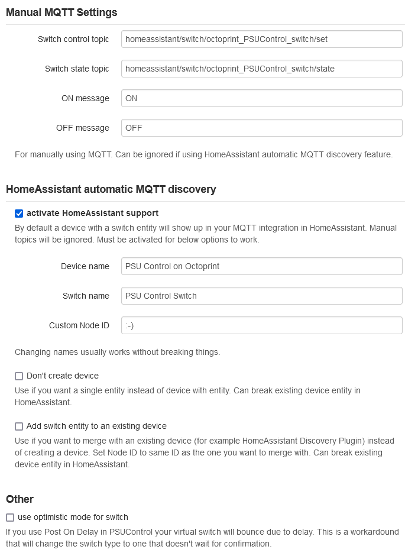
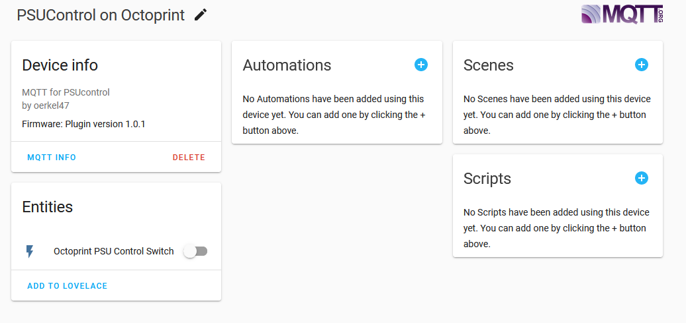

# MQTT exposure for PSUcontrol
Exposes [PSU Control](https://github.com/kantlivelong/OctoPrint-PSUControl) switch over MQTT so you can acces it from somewhere else (example: Home Assistant).

Adds support for [Home Assistant](https://www.home-assistant.io) discovery for automatically integrating into HA.

**This plugin does NOT** add support for external MQTT smart plugs.
For this you can check out a [different plugin](https://github.com/oerkel47/OctoPrint-PSUControl-MQTT)

## Features:
 adds MQTT control to your existing PSU Control switch
 - manual MQTT configuration or
 - HA auto discovery
  
 HA auto discovery options: 
 - create a device   
 - create only an entity
 - add to existing device

## What you need
 - MQTT plugin for OctoPrint: version >= 0.8.10
 - PSU Control plugin for OctoPrint
 - an MQTT broker of course
 - optional: HomeAssistant 

## Additional information
- Should also work if PSU Control subplugins are installed. If additional MQTT is redundant or wanted in this case is up to you.
- If you run into issues, set plugin to debug and check logs. There should be useful information for troubleshooting.

## Screenshot of Octoprint settings

## Screenshot of Home Assistant MQTT device

